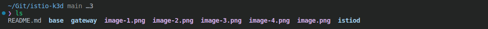
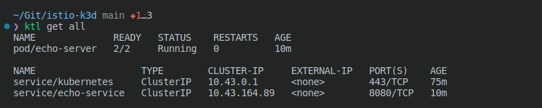
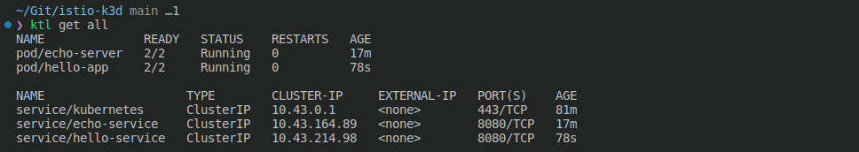

# k3d_istio

step 1: **asdf install plugin in .tool-versions**


```zsh
asdf plugin add k3d https://github.com/spencergilbert/asdf-k3d.git &&
asdf install
```


#
step 2: **Create k3d cluster without traefik**

```zsh 
k3d cluster create DevOps --agents 2 --api-port 0.0.0.0:6443 -p '9080:80@loadbalancer' --k3s-arg "--disable=traefik@server:*"
```


* cluster name: DevOps
* cluster master nodes: 1
* cluster worker nodes: 2
* api-server works on port: 6443

note: if you are using a firewall you can allow this port through $ `sudo iptables -I INPUT -p tcp --dport 6443 -j ACCEPT
` arch-linux
#
step2: **install istio**

```zsh 
helm install istio-base istio/base -n istio-system --create-namespace --set defaultRevision=default
helm install istiod istio/istiod -n istio-system --wait
helm install istio-ingress istio/gateway -n istio-ingress --create-namespace --wait
```
note: verification of established resources
```zsh
helm ls -n istio-system
helm status istio-base -n istio-system
helm status istiod -n istio-system
helm status istio-ingress -n istio-ingress
-----
helm get all istio-base -n istio-system
helm get all istiod -n istio-system
helm get all istio-ingress -n istio-ingress
```
note: Use the below command to label the default namespace with the Istio injection-enabled tag
```zsh 
kubectl label namespace default istio-injection=enabled
```
note: if u gonna use argocd to deploy those charts, u need to getch those repos local on ur side for more visibility
```zsh 
helm fetch istio/base --untar
helm fetch istio/istiod --untar
helm fetch istio/gateway --untar 
```


step 3: **try your first apps using istio gateway, add deploy-pod-serv.yaml**

```zsh
 apiVersion: v1
kind: Pod
metadata:
  name: echo-server
  labels:
    app: echo-server
spec:
  containers:
  - name: echoserver
    image: gcr.io/google_containers/echoserver:1.0
    imagePullPolicy: IfNotPresent
    ports:
    - containerPort: 8080
---
apiVersion: v1
kind: Service
metadata:
  name: echo-service
  labels:
    app: echo-server
spec:
  selector:
    app: echo-server
  ports:
  - port: 8080
    targetPort: 8080
    name: http
```


* create "hello-app.yaml"

```zsh 
apiVersion: v1
kind: Service
metadata:
  name: hello-service
spec:
  ports:
  - port: 8080
    name: http
  selector:
    app: hello-app
---
apiVersion: v1
kind: Pod
metadata:
  labels:
    app: hello-app
  name: hello-app
spec:
  containers:
  - command:
    - /agnhost
    - netexec
    - --http-port=8080
    image: registry.k8s.io/e2e-test-images/agnhost:2.39
    name: agnhost
    ports:
    - containerPort: 8080
```


#
step 4: **we make applications available outside of the Kubernetes cluster by using a gateway and a virtual service that connect the gateway to istio-ingress to route inbound traffic.**

* create "gateway.yaml"

```zsh 
apiVersion: networking.istio.io/v1alpha3
kind: Gateway
metadata:
  name: ingress-gateway
  namespace: istio-ingress
spec:
  selector:
    app: istio-ingress
    istio: ingress
  servers:
  - port:
      number: 80
      name: http
      protocol: HTTP
    hosts:
    - "*"
```
* create "virtualservice.yaml"

```zsh 
apiVersion: networking.istio.io/v1alpha3
kind: VirtualService
metadata:
  name: virtualservice
  namespace: istio-ingress
spec:
  hosts:
  - "*"
  gateways:
  - ingress-gateway
  http:
  - match:
    - uri:
        prefix: /echo
    route:
    - destination:
        host: echo-service.default.svc.cluster.local
        port:
          number: 8080
  - match:
    - uri:
        prefix: /hello
    route:
    - destination:
        host: hello-service.default.svc.cluster.local
        port:
          number: 8080
```

