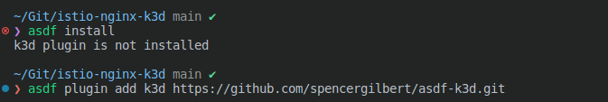
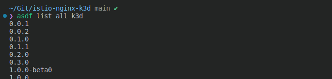
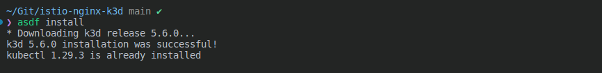

# k3d_istio_nginx

step1. **asdf install plugin in .tool-versions**



```zsh
asdf plugin add k3d https://github.com/spencergilbert/asdf-k3d.git &&
asdf install
```





step2. **asdf install plugin in .tool-versions**

```zsh 

```