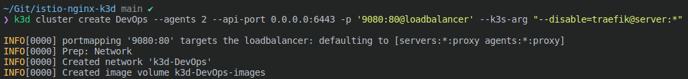

# k3d_istio

step1. **asdf install plugin in .tool-versions**


```zsh
asdf plugin add k3d https://github.com/spencergilbert/asdf-k3d.git &&
asdf install
```


#
step2. **Create k3d cluster without traefik**

```zsh 
k3d cluster create DevOps --agents 2 --api-port 0.0.0.0:6443 -p '9080:80@loadbalancer' --k3s-arg "--disable=traefik@server:*"
```


* cluster name: DevOps
* cluster master nodes: 1
* cluster worker nodes: 2
* api-server works on port: 6443

note: if you are using a firewall you can allow this port through $ sudo ufw allow 6443
#
step2. **install istio**

```zsh 
helm install istio-base istio/base -n istio-system --create-namespace --set defaultRevision=default
helm install istiod istio/istiod -n istio-system --wait
helm install istio-ingress istio/gateway -n istio-ingress --create-namespace --wait
```